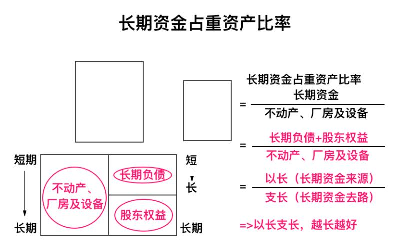
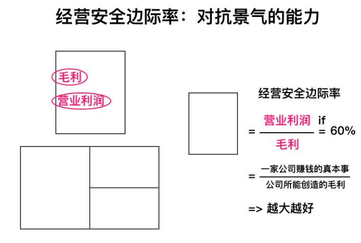

## 五大财务比率(+成长能力)

### 财务结构

#### 负债占资产比率(%)

负债占资产比率反映了在企业的全部资产中借债所占比重的大小，其值越高，代表企业贷款越多杠杆越大，风险也越高。

负债占资产比率 = 负债 / 资产

#### 长期资金占重资产比率(%)

长期资金占重资产比率用于衡量企业的长期稳定资金用来支应固定投资需求状况。其值越大，代表长期债务对重资产杠杆越高，企业越安全。

### 偿债能力

#### 流动比率(%)

流动比率是一家公司的流动资产（包含速动资产和存货）除以流动负债算得的比率，它反映公司的短期清偿能力。

流动比率 = 流动资产总额 / 流动负债总额

#### 速动比率(%)

速动比率是企业的速动资产与流动负债的百分比，它反映公司的最快速清偿能力。

速动比率 = ( 流动资产总额 - 存货 - 预付费用 ) / 流动负债总额

### 运营能力

#### 应收款项周转天数(天)

应收款项周转天数是指企业从取得应收账款的权利到收回款项、转换为现金所需要的时间。它反映了平均收款天数，账期越短则说明回款越快，企业经营压力越小。

应收款项周转天数 = 平均应收账款 × 360天 / 销售收入

#### 应收款项周转率(次/年)

应收款项周转率是指在一定时期内应收账款转化为现金的平均次数。它反映了应收账款当年帮公司做了几轮生意。

应收款项周转率 ＝ 365 / 应收帐款周转天数

#### 存货周转率(次/年)

存货周转率是营业成本与存货总额的百分比。它反映了存货当年帮公司做了几轮生意，越多越好。

存货周转率 = 货物销售成本 / 存货总额

#### 存货周转天数(天)

存货周转天数是指企业从取得存货开始，至消耗、销售为止所经历的天数。它反映了存货在库天数，其值越小越好，越小代表产品越畅销。

存货周转天数 = 365 / 存货周转率

#### 固定资产周转率(次/年)

固定资产周转率又称为固定资产利用率，是指企业年产品销售收入净额与固定资产平均净值的比率。它反映了固定资产当年帮公司做了几轮生意，越多越好。

固定资产周转率 ＝ 产品销售收入净额 / 固定资产平均净值

#### 完整生意周期(天)

完整生意周期反映了一轮完整生意需要经历的天数(从进货到收款)。
完整生意周期即做生意的完整周期，它指的是一家公司从购买原物料开始、投入生产，到产品制作完成变成库存、存入仓库，过程中要付钱给供应商，以及公司的销售人员将存货卖出去，到最后收到客户的货款，所经历的一个完整周期。

完整生意周期 = 存货在库天数（平均销货日数）+ 平均收现日数

#### 应付款项周转天数(天)

应付款项周转天数又称平均付现期，是衡量公司需要多长时间付清供应商的欠款。它反映了公司可以拖上游供应商的账期，越长越有利。

应付款项周转天数 ＝ 期初期末应付账款平均值 * 360 / 主营业务成本

#### 缺钱天数(天)

缺钱天数是指当前生意周期内被押款造成缺少现金的天数。
缺钱的天数，专业名词叫现金转换周期，是做生意的完整周期扣除应付帐款付款天数。

缺钱的天数（现金转换周期) = 做生意的完整周期 - 应付帐款付款天数

#### 总资产周转率(次/年)

总资产周转率是营业收入与平均总资产的比值，用于衡量每一单位的资产能创造出多少营业收入。

总资产周转率反映了当年总共做了几轮生意。

资产周转率

= 销售收入 / 平均总资产

= 销售收入 / ((期初资产 + 期末资产)/2)

### 盈利能力

#### ROA=资产收益率(%)

资产回报率(ROA)是指总资产的收益率(股东权益加负债)。 它衡量一家公司从股东权益和负债中产生利润的效率。

资产回报率(%)

= 净收益 / 平均总资产

= 净收益 / ((期初资产 + 期末资产)/2)

或

资产回报率(%) =

= 净利率 x 总资产周转率

#### ROE=净资产收益率(%)

净资产收益率(ROE)是指普通股股东应占净收益除以其总股东权益。它反映了总资产的投资回报率。
净资产收益率是总资产的投资回报率。净资产收益率按净收入除以总资产计算。

净资产收益率 (ROE%)

= 普通股股东应占净收益 / 股东权益

= 净利率 x 总资产周转率 x 杠杆倍数

#### ROIC=资本回报率(%)

资本回报率 ROIC，也称为投入资本回报率、投资资本回报率，是指公司使用资金与相关回报之间的比例。 ROIC 是衡量公司盈利能力的一个指标。

资本回报率 (ROIC%)

= 息税前利润 EBIT x (1 - 税率) / 投入资本

#### 税前纯益占实收资本(%)

税前纯益占实收资本比率是指税前纯益占实收资本的百分比。它反映了税前利润相对实收股本倍数。(若税前纯益占实收资本额比率越大，税前利润越大，则公司在本期的利润越大。)

税前纯益占实收资本比率 = 税前纯益 / 总股本 = (营业利润 + 营业外收入 - 营业外支出) / 总股本

#### 毛利率(%)

毛利率是公司销售毛利占营业收入的百分比，它反映生意本身的好坏，越高越是好生意。

毛利 =（营业收入 - 营业成本）

毛利率 = 毛利 / 营业收入

#### 营业利润率(%)

营业利润率是营业利润除以营业收入的百分比，它反映公司赚钱的真本事,越高越好。

营业利润率 = 营业利润 / 营业收入

#### 净利率(%)

净利，是指企业主营业务收入减去主营业务成本、管理费用、销售费用、财务费用、营业税金及附加、营业外支出、所得税；加上其他业务利润、营业外收入得出的金额。

净利率(%) = 净收入 / 收入

#### 营业费用率(%)

营业费用率是指从事营业活动所需花费的各项费用在营业收入中的比重。营业费用率反映了公司运营三费(销管财)支出占销售额比率。

营业费用率 = 营业费用 / 营业收入

#### 经营安全边际率(%)

经营安全边际率是营业利益占毛利的比率，它反映了企业对抗市场不景气的能力。

经营安全边际率 = 营业利润率 / 毛利率

#### EPS=基本每股收益(元)

每股收益（EPS）是公司税后总利润与普通股股本总数的比率， EPS 反映了股东每股可以赚多少钱。

每股收益（EPS）是公司税后总利润与普通股股本总数的比率。

基本每股收益(元) (EPS) = (净收入 - 优先股息) / 已发行股份基本平均数

### 成长能力

#### 营收增长率(%)

营收增长率是本期主营业务收入与上期主营业务收入之差与上期主营业务收入的比值。营收增长率反映了每年营收增长速度。

营收增长率 ＝ （本期主营业务收入 － 上期主要业务收入）/ 上期主营业务收入

#### 营业利润增长率(%)

营业利润增长率又称销售利润增长率，是企业本年营业利润增长额与上年营业利润总额的百分比。它反映了每年营业利润增长速度。

营业利润增长率 = (本年营业利润总额 - 上年营业利润总额) / 上年营业利润总额

#### 净资本增长率(%)

净资本增长率是指企业本期净资产增加额与上期净资产总额的百分比。它反映了企业每年净资产增长速度。

净资本增长率 =（期末净资产 — 期初净资产）/ 期初净资产

### 现金流量

#### 现金流量比率(%)

现金流量比率反映了年营收现金对流动负债的偿还能力。

现金流量比率是指未扣除利息、所得税、折旧以及摊销前的盈余(EBITDA)除以利息或本息之和的比率。它反映了企业通过经营获取足够现金来偿还债务和兑现承诺的能力。现金流量比率越高，则表示企业偿债能力越好；比率越低，则表示企业短期偿债能力越差。

现金流量比率 = 营业活动净现金流量 / 流动负债

#### 现金流量允当比率(%)

现金流量允当比率是存货占总资产的百分比。它反映了近 5 年营收资金满足公司成长的自给自足率。

现金流量允当比率() = 最近5年度营业活动净现金流量 / 最近5年度（资本支出 + 存货増加额+ 现金股利)

现金流量允当比率大于100%，也就是说公司最近的五个年度 ，靠正常的营业活动所赚进来的现金流量，大于最近五个年度为了成长所需的资本支出、存货和固定要发给股东的现金股利。现金流量允当比率的数值越大越好。

现金流量允当比率 >100%，代表公司最近五个年度不需要对外借钱融资，自己赚的钱(营业活动现金流量)就能自给自足，支应基本的成长所需；同时也代表公司最近五个年度自己所赚的钱已经够用，不 太需要看银行或股东的脸色，因为如果公司缺资金的话，需要从这两种管道借钱。如果经营公司不需要看银行或大股东的脸色，这当然是最好的情况。

现金流量指标的分析标准是“比气长，越长越好”，数字越大越好，能够完全满足“大于100／100／10”更好，也就是同时满足现金流量比率 > 100% 、现金流量允当比率 > 100%和现金再投资比率 > 10%。

#### 现金再投资比率(%)

现金再投资比率反映了企业当年手上真正能留存下来的现金多少。

现金再投资比率 = (业活动净现金流 - 现金股利) / (固定资产毛额 + 长期投资 + 其他资产 + 运营资金)

## 资产负债比率

#### 现金与约当现金(%)

现金与约当现金占总资产比率是指“现金与约当现金”占总资产的百分比。它反映了公司可支配自由现金比例（「现金流断裂」指的就是这个数值过小）

现金与约当现金占总资产比率 = (现金+约当现金) /总资产

#### 应收账款(%)

应收款项占总资产比率是指应收款项占总资产的百分比。公司的款项如果太大，则说明公司收款能力不行，或者报表有水份(水份重灾区)。

应收款项占总资产比率 = 应收款项 / 总资产

#### 存货(%)

存货占总资产比率是存货占总资产的百分比。其值太大说明货卖不动，或者报表有水份(水份重灾区)。

存货占总资产比率 = 存货 / 总资产

#### 其他流动资产(%)

其他流动资产占总资产比率是其他流动资产占总资产的百分比。其他流动资产，常会有各种理财存款等金融产品在此项目中，在某些情况下可以转换为现金。

其他流动资产占总资产比率 = 其他流动资产 / 总资产

#### 流动资产(%)

流动资产占总资产比率是指流动资产占总资产的百分比。它反映了公司的轻资产比例(比较容易折现的资产)。

流动资产占总资产比率 = 流动资产 / 总资产

#### 商誉(%)

商誉占总资产比率是指商誉占总资产的百分比。商誉是一种无形资产，是由于一家公司以溢价收购另一家公司而产生。

商誉比率 = 商誉 / 总资产

#### 非流动资产(%)

非流动资产占总资产比率是指非流动资产占总资产的百分比。它反映了公司的重资产比例(比较难以折现的资产)。

非流动资产占总资产比率 = 非流动资产 / 总资产

#### 应付款项(%)

应付款项占总资产比率是指应付款项占总资产的百分比。应付款项是企业对上游供应商的应付欠款。

应付款项占总资产比率 = 应付款项 / 总资产

#### 流动负债(%)

流动负债占总资产比率是指流动负债占总资产的百分比。它反映了企业一年期负债总计比例。

流动负债总资产比率 = 流动负债 / 总资产

#### 非流动负债(%)

非流动负债占总资产比率是指非流动负债占总资产的百分比。它反映了企业的长期负债比例。

非流动负债占总资产比率 = 非流动负债 / 总资产

#### 股东权益(%)

股东权益比率 ＝ 股东权益 / 总资产

## 现金流量表

#### 期初现金

#### 营业活动现金流量

营业活动现金流量是指通过公司正常经营活动所带来的现金。它是企业经营生意赚到的钱：当年正常经营活动流入的现金总额(从利润表结余现金流入)。

#### 投资活动现金流量

投资活动现金流量，是企业投资花出去的钱：当年投资购买资产造成的现金减少值(用于资产负债表左边购买资产)。

投资活动现金流量包括公司在金融市场和运营子公司的投资活动中获得或花费的现金，它还包括公司用于不动产、厂场和设备的现金(PPE)。

#### 筹资活动现金流量

融资活动现金流量，反映了企业从外面找来的钱：当年融资流入的现金总额(资产负债表右边融到的现金)。

融资活动现金流量是指从诸如股票发行(回购)、债务发行(偿还)和支付给优先股和普通股股东的股息等金融活动中产生和使用的现金。

#### 期末现金

#### 自由现金流(FCF)

自由现金流(FCF)，是本期可随意支取的现金，最好用的现金流，也是巴菲特最关注指标。

自由现金流(FCF) = 营业活动现金流量(OCF) - 资本支出